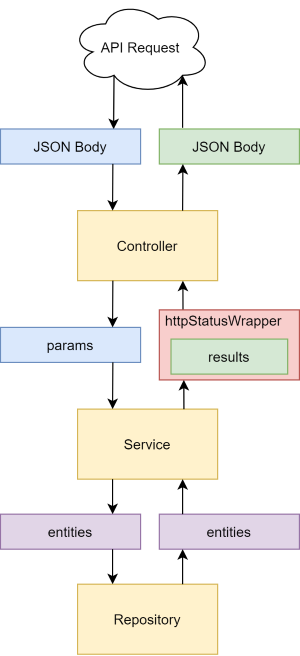

# Accounter

### 1. 개요

Accounter는 간단한 Rest API 서비스 입니다.

Accounter가 제공하는 핵심 기능은 다음과 같습니다.

- [x] HTTP를 통한 CRUD Rest API
- [x] csv to DB Import
- [ ] Web GUI 환경 (TBD)

### 2. 개발환경  

- SpringBoot + Maven
- JAVA: 1.8
- IDE : IntelliJ
- DB: H2 (On Memory)
- Plugins : Lombok

### 3. 구성상세

Accounter 서비스는 다음과 같이 구성되어 있습니다.

- DB Schema  
  
- 서비스 전달 경로  
  

  
### 4. API 요청형식

Accounter는 CRUD 동작을 지원하며 요청 형식은 다음과 같습니다.

- go_company
  - **GET**  
    - Request URL
    ``` url
    http://serverIp:serverPort/account/all              // 모든 회사 조회
    http://serverIp:serverPort/account{companyId}/list  // 특정 ID 회사 조회
    ```
    - Request Body  
    _별도의 형식 없는 빈 JSON_
    ``` json
    {}
    ```

    - Response Body  
    _결과와 HTTP Status code 가 포함된 JSON_
    ``` json
    {
      "statusCode": "200",
      "statusMessage": "OK",
      "returnResult": [
        // 반환된 데이터
      ]
    }
    ```
  
  - **POST** 
    - Request URL 
    ``` url
    http://serverIp:serverPort/api/companies/add    // 아래 JSON Body 회사추가
    ```

    - Request Body
    ``` json
    {  
      "companyName": "(String)",    //  회사명
      "connectionId": "(Long)",     //  연동 ID
      "usersTotal": "(Long)",       //  사용자 총 계정수
      "usersUse": "(Long)",         //  사용 계정수
      "accountCount": "(int)",      //  계정과목 수
      "serviceInUse": "(Boolean)",  //  서비스 사용유무
      "otherService": "(Boolean)",  //  타시스템 연동 여부
      "createdAt": "(Date)",        //  생성일
      "modifiedAt": "(Date)",       //  수정일
      "deletedAt": "(Date)"         //  삭제일
    }
    ```

    - Response Body
    ``` json
    {
      "statusCode": "200",
      "statusMessage": "OK",
      "returnResult": []
    }
    ```

  - **PUT**
    - Request URL
    ``` url
    http://serverIp:serverPort/api/companies/{companyId}  // 수정을 원하는 companyId
    ```
    - Request Body
    ``` json
    {
      // 수정이 필요한 데이터 항목
    }
    ```
    - Response Body
    ``` json
    {}
    ```


  - **DELETE**
    - Request URL
    ``` url
    http://serverIp:serverPort/api/companies/{companyId}  // companyId 회사 삭제
    ```
    _별도의 형식 없는 빈 JSON_
    ``` json
    {}
    ```

- go_account_subject
  - **GET**
    - Request URL
    ``` url
    http://serverIp:serverPort/api/accounts/all   // 모든 계정정보 조회
    ```
    - Request Body
    _별도의 형식 없는 빈 JSON_
    ``` json
    {}
    ```
    - Response Body
    ``` json
    {
      "statusCode": "200",
      "statusMessage": "OK",
      "returnResult": [
        // 반환된 데이터
      ]
    }
    ```

  - **POST**
    - Request URL
    ``` url
    http://serverIp:serverPort/api/accounts/add
    ```
    - Request Body
    ``` json
    {
      "accountSytem": "(String)",                     // 계정체계
      "accountSubjectNameDetail": "(String)",         // 과목명(세목)
      "accountSubjectName": "(String)",               // 과목명(목)
      "relationAccountSubjectNameDetail": "(String)", // 관계계정과목명
      "division": "(Long)",                           // 회사코드
      "accountCode": "(Long)",                        // 계정코드
      "relationCode": "(Long)",                       // 관계코드
      "createdAt": "(Date)",                          // 생성일
      "modifiedAt": "(Date)",                         // 수정일
      "deletedAt": "(Date)"                           // 삭제일
    }
    ```
    - Response Body
    ``` json
    {
      "statusCode": "200",
      "statusMessage": "OK",
      "returnResult": []
    }
    ```

  - **PUT**
    - Request URL
    ``` url
    http://serverIp:serverPort/api/accounts/{accountId}   // 수정을 원하는 {accountId}
    ```
    - Request Body
    ``` json
    {
      // 수정이 필요한 데이터 항목
    }
    ```
    - Response Body
    ``` json
    {}
    ```

  - **DELETE**
    - Request URL
    ``` url
    http://serverIp:serverPort/api/accounts/{accountId}   // 제거를 원하는 {accountId}
    ```
    - Request Body
    ``` json
    {}
    ```
    - Response Body
    ``` json
    {}
    ```

API를 통한 데이터 CRUD 작동 외에도 파일 업로드를 통한 데이터 삽입도 가능합니다.

- 파일 업로드 API

  파일 업로드는 POST 요청을 통해 이루어집니다.

  - 업로드 파일 형식  
    ```
    CSV
    회사명,계정체계,계정코드,과목명(세목),과목명(목),분류,관계코드,관계계정과목명
    다우기술,매출원가,131000,선급금,,일반,,
    다우기술,매출원가,132000,대손충당금_선급금,,차감,131000,선급금
    다우기술,매출원가,,선급비용,,일반,,
    ```

  - 파일 업로드 API 주소
    ``` url
    http://serverIp:serverPort/upload
    ```

  - POST 요청 Parameter
    ``` JSON
    Data Type : form-data
    Data key : account, company
    Data format : account.csv, company.csv
    ```
    데이터는 CSV형식이어야 하며 확장자가 CSV가 아닌경우 요청이 거절됩니다.

    `application.properties` 를 이용해 업로드 될 파일 크기를 지정할 수 있으며
    Accounter에서는 1000MB로 설정되어 있습니다.

  - 업로드 성공 시 반환 JSON
    ``` JSON
    {
      "statusCode": "200",
      "statusMessage": "OK",
      "returnResult": []
    }
    ```

  - 업로드 실패 시 반환 JSON
    ``` JSON
    {
      "statusCode": "200",
      "statusMessage": "OK",
      "returnResult": [
        "[IOException] 파일이름 => Failed to read."
      ]
    }
    ```
    IOException 발생 시 읽기를 실패한 파일의 이름을 returnResult에 담아 반환

### 5. 테스트 방법

Postman 툴을 이용하여 JSON 형태의 body 전송 후 반환 결과 확인 (TBD)

### 6. 수행결과 (TBD)

올바른 JSON 형식 및 포멧으로 반환되는지 확인 (TBD)

- go_company
  - GET
  - POST
  - PUT
  - DELETE

- go_account_subject
  - GET
  - POST
  - PUT
  - DELETE
